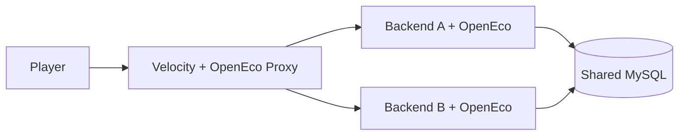

# Installation

This guide walks through a standard single-server install. For proxy networks, see the [network mode](#network-mode) section and the [Production guide](/docs/production).

## Single-server install

### 1. Install dependencies

1. Run **Java 21** on your server.
2. Install **Paper 1.20.5+** or **Folia 1.21+**.
3. Install **Vault** or **VaultUnlocked** in `plugins/`.
4. Install **PlaceholderAPI** if you want placeholders (optional).

### 2. Install OpenEco

1. Download `OpenEco-<version>.jar` from [GitHub Releases](/docs/download).
2. Place the JAR in `plugins/`.
3. Start the server once to generate `plugins/OpenEco/config.yml`.
4. Stop the server and review the config.
5. Back up `plugins/OpenEco/` before reopening.
6. Start the server again.

### 3. Verify

Run these checks before opening to players:

```
/balance
/baltop
/pay <player> 1
/history
/eco reload
```

Also verify at least one Vault-dependent plugin (shop, jobs, rewards) can read and write balances.

::: tip Config folder name
The Bukkit plugin id is `openeco`, but the data folder is `plugins/OpenEco/`. Both names refer to the same plugin.
:::

## First-run configuration

Review these sections in `plugins/OpenEco/config.yml` before launch:

| Section | What to check |
|---|---|
| `currencies` | Default currency and definitions |
| `storage` | Backend type and connection settings |
| `persistence.autosave-interval-seconds` | Background flush frequency |
| `pay` | Cooldown, tax, minimum amount |
| `history.retention-days` | `-1` keeps all history |
| `messages` | MiniMessage chat strings |

See [Configuration](/docs/configuration) for the full reference.

### Restart-required settings

These cannot be changed safely with `/eco reload` alone:

- `storage.type` and database file names
- Remote database connection targets
- `cross-server.enabled`

## Network mode

Use network mode only when you run multiple backend servers behind a Velocity proxy that share one remote database.

### Checklist

1. Use **MySQL, MariaDB, or PostgreSQL** — SQLite and H2 are not supported for cross-server mode.
2. Set `cross-server.enabled: true` on **every** backend.
3. Install the **OpenEco Proxy** JAR on Velocity.
4. Restart the proxy and all backends after toggling cross-server mode.
5. Test at least one server switch and one `/ecosync <player>` before production use.

::: warning Not a distributed ledger
Network mode flushes and refreshes accounts during player handoff. It does not broadcast balances live to every backend or protect against simultaneous writes from multiple servers.
:::

### Typical network layout



## Migrating from another economy plugin

If you are replacing an existing economy plugin:

1. Put the server in maintenance mode.
2. Install **OpenEcoMigrator** alongside OpenEco.
3. Run `/openecomigrate <source> --scan`, then `--dry-run`, then import.
4. Switch Vault to OpenEco and remove the old economy plugin.

See [Migration](/docs/migration) for supported sources and workflows.

## Troubleshooting

| Symptom | Likely cause |
|---|---|
| Plugin disables on startup | Storage connection failed or account load error — check console |
| Vault plugins see no economy | Vault not installed, or OpenEco failed to register providers |
| Balances reset after crash | Up to one autosave interval of changes may be lost — lower `persistence.autosave-interval-seconds` |
| Cross-server balances stale | `cross-server.enabled` not set on all backends, or proxy addon missing |

For deeper operational guidance, see [Production guide](/docs/production) and [Technical notes](/docs/technical).
